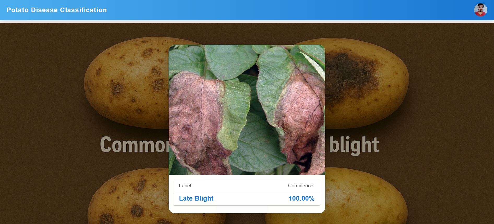

📂 Dataset

    The dataset used in this project contains images of potato leaves categorized into the following classes:

    Healthy

    Early Blight

    Late Blight

    You can download the dataset from [PlantVillage Dataset](https://www.kaggle.com/datasets/arjuntejaswi/plant-village)
.

🛠️ Tech Stack

    Python 3.x

    TensorFlow / Keras

    OpenCV

    NumPy, Pandas, Matplotlib

    Flask (for deployment, optional)

📊 Model Workflow

    Data Preprocessing – Image resizing, normalization, augmentation

    Model Training – CNN architecture with TensorFlow/Keras

    Evaluation – Accuracy, confusion matrix, loss curves

    Deployment – Model can be integrated into a web app

🚀 How to Run
🔹 Clone the Repository
    git clone https://github.com/<your-username>/potato-disease-classification.git
    cd potato-disease-classification

🔹 Install Dependencies
    pip install -r requirements.txt

🔹 Train the Model
    python train.py

🔹 Test / Predict
    python predict.py --image sample_leaf.jpg

📷 Sample Predictions
    

📌 Future Work

    Extend model to classify more potato diseases

    Build a mobile app for real-time leaf disease detection

    Integrate with IoT devices in smart farming systems

🤝 Contributing

    Contributions are welcome! If you’d like to improve this project, feel free to fork and submit a pull request.

⚡ Developed with ❤️ for Smart Agriculture